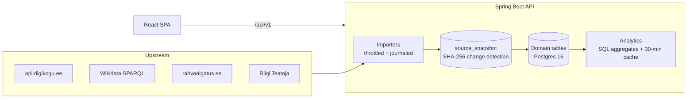

<div align="center">
  

  # Riigiluup

  **A civic-tech lens on the Estonian Parliament.**

  [riigiluup.ee](https://riigiluup.ee) · open data, made readable

  
  
  
  
  [](https://github.com/DefinitelyN0tMe/riigiluup/actions/workflows/ci.yml)
</div>

---

## What is this?

*Riigiluup* (Estonian: "state loupe") takes the open data that the Riigikogu — the Parliament of Estonia — already publishes, and turns it into something a person can actually read.

For every member of parliament you can see:

- 🗳️ **How they voted** — every roll-call vote, including the times they broke with their own faction
- 📜 **What they proposed** — bills sponsored and where each one is in the legislative pipeline
- 🎤 **What they said** — full-text searchable plenary speeches (100k+ and counting)
- 🏛️ **Where they sit** — committees, factions, and party membership history (cross-referenced with Wikidata)
- 💶 **Who funds their party** — political party financing from the ERJK register
- ⚖️ **Side-by-side comparison** — pick any two MPs and compare their voting records directly

Plus an analytics section: voting similarity between MPs, faction discipline, attendance patterns, the citizens' initiative funnel, and more. Everything is available in **Estonian, English, and Russian**.

No accounts, no tracking, no paywall — just public data presented honestly. Where numbers are shown, they link back to the underlying votes so you can check the work.

## Data sources

| Source | What we take from it |
|---|---|
| [api.riigikogu.ee](https://api.riigikogu.ee) | MPs, factions, committees, bills, votes, stenograms (CC BY-SA 3.0) |
| [Wikidata](https://www.wikidata.org) | Party membership history (P102), biographies |
| [rahvaalgatus.ee](https://rahvaalgatus.ee) | Citizens' initiatives and their parliamentary journey |
| [Riigi Teataja](https://www.riigiteataja.ee) | Links from passed bills to the acts they became |
| valimised.ee | Election results |
| ERJK | Party financing reports |

Importers are polite by design: requests to the parliament API are throttled to ~1 rps, raw payloads are snapshotted with change-detection, and every import run is journaled.

---

## For developers

### Stack

**Backend** — Java 21, Spring Boot 3.3, PostgreSQL 16, Flyway, Caffeine cache, Resilience4j (retry + circuit breaker around upstream APIs).
**Frontend** — React 18, TypeScript (strict), Vite, Tailwind CSS, TanStack Query, i18next. Visualisations are hand-rolled SVG — no chart libraries.
**Ops** — Docker Compose, nginx (TLS, CSP, rate limiting), GitHub Actions CI.

### Architecture in one diagram



Backend packages follow **package-by-feature** (`person`, `vote`, `legislation`, `speech`, `committee`, `initiative`, `analytics`, `ingestion`, `admin`, …). Importers upsert by natural key, run per-item transactions, and survive partial upstream failures; a resumable orchestrator (`/api/v1/admin/backfill/full`) seeds the full history in dependency order.

### Run it locally

Prerequisites: Docker with the Compose plugin. That's it.

```bash
docker compose up --build
```

| Service | URL |
|---|---|
| Frontend | http://localhost:5173 |
| Backend API | http://localhost:18080 |
| Postgres | localhost:15432 |

Dev credentials live in `docker-compose.yml`. Running the backend directly with `./gradlew bootRun` uses the `local` profile by default and serves on port 8081.

The database starts empty. To load data, kick off a backfill (dev admin password is `change-me`):

```bash
curl -u admin:change-me -X POST \
  "http://localhost:18080/api/v1/admin/backfill/full?from=2023-04-01&kinds=ALL"
```

MPs and factions appear within minutes; the full history of votes and speeches takes a few hours at the polite request rate. Progress: `GET /api/v1/admin/backfill/full/latest`.

### Tests

```bash
./gradlew test              # fast unit suite (no Docker needed)
./gradlew integrationTest   # @Tag("integration") against a real Postgres 16 (Testcontainers)
cd frontend && npx tsc --noEmit && npm run build && npx eslint src
cd frontend && npx playwright test   # e2e smoke suite
```

HTTP clients are tested against WireMock; repositories against a real Postgres via Testcontainers (a pre-started database can be injected with `RIIGILUUP_IT_JDBC_URL` — see `backend/build.gradle.kts` for the Windows escape hatch).

### Security posture

- Admin panel: Google OIDC with an email allow-list; HTTP Basic exists as a dev/staging fallback only. **In the `prod` profile the app refuses to start without OIDC configured, with a default admin password, or with a default database password.**
- All native SQL is parameterised; ingested HTML (biographies) is sanitised with jsoup before storage.
- Per-IP rate limiting behind nginx (`X-Real-IP`), strict CSP, HSTS, actuator reduced to `/actuator/health` by default.

### Deployment

Production configuration lives in `deploy/`: hardened nginx, TLS issuance/renewal scripts, backups, and a server bootstrap script (`init-server.sh` — ufw, fail2ban, Docker). Copy `deploy/.env.production.example` to `.env` and set at minimum:

```
POSTGRES_PASSWORD=<generated>
RIIGILUUP_ADMIN_PASSWORD=<generated>
GOOGLE_OAUTH_CLIENT_ID=<from Google Cloud Console>
GOOGLE_OAUTH_CLIENT_SECRET=<from Google Cloud Console>
RIIGILUUP_ADMIN_ALLOWED_EMAILS=you@example.com
```

Then `docker compose -f docker-compose.prod.yml up -d`. A site-wide private-beta gate (nginx basic auth + `noindex`) is available for pre-launch testing.

### Project layout

```
backend/    Spring Boot API — importers, domain, analytics, admin
frontend/   React SPA — pages, components, i18n (et/en/ru)
deploy/     production compose, nginx, TLS & backup scripts
.github/    CI: unit + integration tests, frontend build, bundle report
```

## Contributing

Issues and pull requests are welcome. The short version: keep the fast test suite green (`./gradlew test`), match the surrounding code style, and be kind to the upstream APIs — they are a shared resource.

## Data licence

Parliamentary data © Riigikogu, republished under [CC BY-SA 3.0](https://creativecommons.org/licenses/by-sa/3.0/). This project displays and aggregates it with attribution; verify anything important against the primary sources linked throughout the UI.
